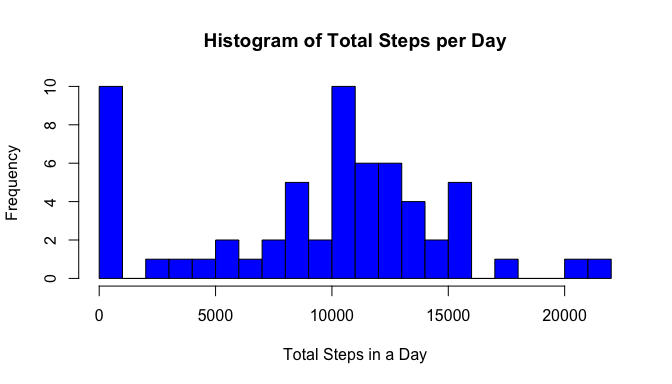
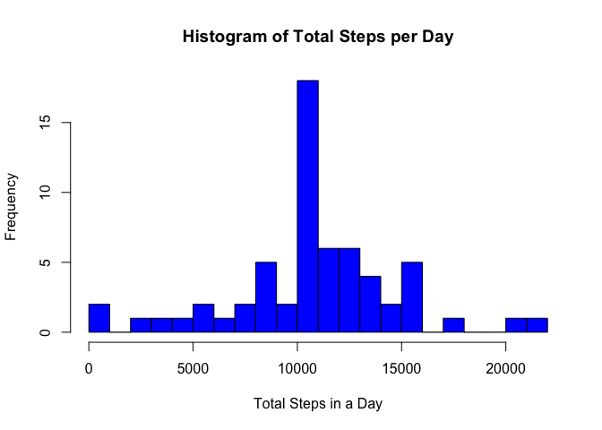

## Loading and preprocessing the data

```r
data <- read.csv("activity.csv", 
                 header = TRUE, 
                 stringsAsFactors = FALSE)
```


## What is mean total number of steps taken per day?

```r
library(dplyr)
view <- data %>% 
        group_by(date) %>% 
        summarize(total.steps = sum(steps, na.rm = TRUE))
with(view, {
        hist(total.steps, 
             col = "blue1", 
             xlab = "Total Steps in a Day", 
             main = "Histogram of Total Steps per Day")
        })
```

<!-- -->

```r
steps.median <- format(median(view$total.steps), big.mark = ",", digits = 0)
steps.mean <- format(mean(view$total.steps), big.mark = ",", digits = 0)
```

The median total step count is 10,395 and the mean total step count is
9,354.

## What is the average daily activity pattern?

```r
view <- data %>% 
        group_by(interval) %>% 
        summarize(average.steps.in.interval = mean(steps, na.rm = TRUE))
with(view, {
        plot(interval, average.steps.in.interval, 
             type = "l",
             col = "blue1", 
             xlab = "5 Minute Intervals", 
             ylab = "Average Steps",
             main = "Average Daily Activity Pattern")
        })
```

<!-- -->

```r
maxinterval <- view$interval[view$average.steps.in.interval == max(view$average.steps.in.interval)]
```

The interval containing the maximum average number of steps is 835.

## Imputing missing values

#### Strategy

For each missing value, the value is replaced with the mean value for that interval.

#### Code


```r
impute <- function(df) { 
        tmp <- df
        for(i in 1:length(tmp$steps)) {
                if(is.na(tmp$steps[i])) {
                        tmp$steps[i] <- view$average.steps.in.interval[view$interval == tmp$interval[i]]
                }
        }
        tmp
}

imputed <- impute(data)

view2 <- imputed %>%
        group_by(date) %>% 
        summarize(total.steps = sum(steps))

with(view2, {
        hist(total.steps, 
             col = "blue1", 
             xlab = "Total Steps in a Day", 
             main = "Histogram of Total Steps per Day")
        })
```

<!-- -->

```r
steps2.median <- format(median(view2$total.steps), big.mark = ",", digits = 5)
steps2.mean <- format(mean(view2$total.steps), big.mark = ",", digits = 5)
```

The median total step count is 10,766 and the mean total step count is
10,766.

## Are there differences in activity patterns between weekdays and weekends?


```r
library(lattice)

assignDayLevels <- function(date_vec) {
        weekend <- c("Saturday", "Sunday")
        assign_vec <- NULL
        for(i in 1:length(date_vec)) {
                tmp <- as.Date(date_vec[i])
                if(weekdays(tmp) %in% weekend) {
                        assign_vec[i] <- TRUE
                } else {
                        assign_vec[i] <- FALSE                
                }
        }
        assign_vec
}

view3 <- imputed %>%
        mutate(day.level := as.factor(assignDayLevels(date))) %>%
        group_by(day.level, interval) %>%
        arrange(desc(day.level), interval) %>%
        summarize(average.steps = mean(steps))
levels(view3$day.level) <- c("weekday", "weekend")

xyplot(average.steps ~ interval | day.level,
       data = view3,
       type = "l",
       layout = c(1,2),
       xlab = "Interval", 
       ylab = "Number of Steps",
       main = "Average Daily Activity Patterns (Weekends vs. Weekdays)")
```

<!-- -->
